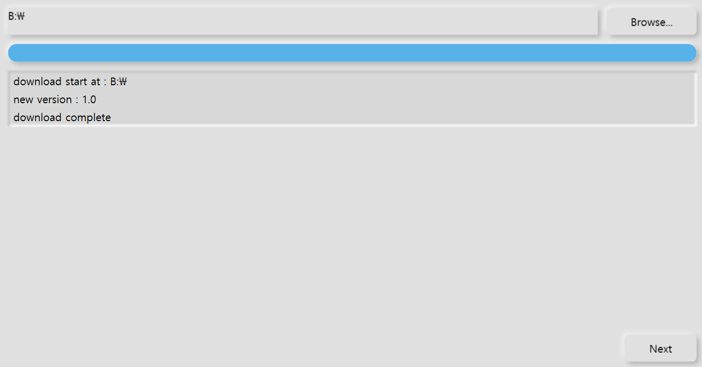

# MinUI

MinUI는 Neumorphism 디자인을 이용한 WPF 컨트롤 라이브러리입니다. 

이 프로젝트는 포트폴리오를 목적으로 개발 중에 있습니다.

## 소개

MinUI는 Neumorphism 디자인을 WPF에 적용하였습니다.

프로젝트 구성은 다음과 같습니다.

- **MinUI.Core**: 컨트롤 모음
- **MinUI.DownloadTest**: installer
- **MinUI.UpdateServer**: installer server

## Screenshots

